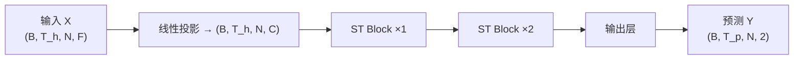

# ASTGCN：注意力时空图卷积网络

## 1. 问题建模

将 B 线地铁网络建模为时空图 $\mathcal{G} = (\mathcal{V}, \mathcal{E}, \mathbf{A})$：

- **节点** $\mathcal{V}$：34 个地铁站 $(|\mathcal{V}| = N = 34)$
- **边** $\mathcal{E}$：站点间连接关系（来自 `Metro_roadMap.csv`）
- **邻接矩阵** $\mathbf{A} \in \mathbb{R}^{N \times N}$：对称归一化邻接矩阵

$$
\mathbf{A}_{\text{norm}} = \mathbf{D}^{-\frac{1}{2}} (\mathbf{A} + \mathbf{I}) \mathbf{D}^{-\frac{1}{2}}
$$

> **D 是什么？归一化干了什么？**

**（1）$\mathbf{D}$ 是度矩阵（Degree Matrix）**

$\mathbf{D}$ 是 $(\mathbf{A} + \mathbf{I})$ 的度矩阵，一个对角阵：

$$
D_{ii} = \sum_j (A_{ij} + I_{ij}) = 1 + (\text{站点 } i \text{ 的邻居数})
$$

```
  原图 A+I（加自环后）              度矩阵 D                    D^{-1/2}
  ┌─────────────────┐          ┌─────────────────┐       ┌─────────────────┐
  │ 1  1  0  0      │          │ 2  0  0  0      │       │ 1/√2  0   0   0 │
  │ 1  1  1  0      │   →      │ 0  3  0  0      │  →    │  0  1/√3  0   0 │
  │ 0  1  1  1      │          │ 0  0  3  0      │       │  0   0  1/√3 0 │
  │ 0  0  1  1      │          │ 0  0  0  2      │       │  0   0   0 1/√2│
  └─────────────────┘          └─────────────────┘       └─────────────────┘
  站点0: 邻居{1}+自己          D[0][0]=2(度)            站点0的缩放因子=1/√2
  站点1: 邻居{0,2}+自己        D[1][1]=3                站点1的缩放因子=1/√3
```

**（2）归一化做了什么？**

归一化后矩阵元素变为：

$$
A_{\text{norm}}[i][j] = \frac{A_{ij} + I_{ij}}{\sqrt{D_{ii} \cdot D_{jj}}}
$$

**数值实例**（4 站链状图 0—1—2—3）：

```
  未归一化的 A+I                    归一化后的 A_norm
  ┌─────────────────┐          ┌──────────────────────────┐
  │ 1  1  0  0      │          │ 1/2    1/√6    0      0  │
  │ 1  1  1  0      │   →      │ 1/√6   1/3    1/3     0  │
  │ 0  1  1  1      │          │  0     1/3    1/3   1/√6 │
  │ 0  0  1  1      │          │  0      0    1/√6   1/2  │
  └─────────────────┘          └──────────────────────────┘
  
  站点1(度=3)对站点0(度=2)的权重 = 1/√(3×2) = 1/√6 ≈ 0.408
  站点1(度=3)对自己              的权重 = 1/√(3×3) = 1/3  ≈ 0.333
  站点0(度=2)对自己              的权重 = 1/√(2×2) = 1/2  = 0.500
```

**（3）为什么要归一化？—— 不做会怎样？**

```
不做归一化：A × H
  站点15（枢纽站，10个邻居）的特征 = 10个站点的特征之和 → 数值爆炸 💥
  站点33（末端站，1个邻居）  的特征 = 1个站点的特征     → 数值微小
  
  → 多邻居的站点天然"嗓门大"，不是因为它重要，只是因为它连接多

做归一化：D^{-1/2} A D^{-1/2} × H
  站点15的特征 = 每个邻居 × 1/√(11×dⱼ) ≈ 平均一下
  站点33的特征 = 邻居 × 1/√(2×dⱼ)    ≈ 也差不多
  
  → 所有站点的特征尺度保持在同一量级，避免"富人越富"
```

**（4）一句话总结**

> $\mathbf{D}^{-\frac{1}{2}} (\mathbf{A}+\mathbf{I}) \mathbf{D}^{-\frac{1}{2}}$ 就是把"谁和谁是邻居"这张表，**按每个站点的邻居数量做了缩放**，让邻居多的站点和邻居少的站点在 GCN 里有平等的发言权。

每个时段 $t$ 的图信号：$\mathbf{X}_t \in \mathbb{R}^{N \times F}$，其中 $F = 7$（hour, minute, weekday, is_weekend, is_peak, inNums, outNums）。

**预测任务**：给定历史 $T_h = 12$ 个时段（2小时），预测未来 $T_p = 3$ 个时段（30分钟）的各站点进出站人数。

$$
\hat{\mathbf{Y}} = f\left( \mathbf{X}_{t-T_h+1}, \ldots, \mathbf{X}_t ;\; \mathbf{A}_{\text{norm}} \right)
$$

---

## 2. 整体架构



每个 **ST Block** 包含四个组件：

```
时间注意力 → 空间注意力 → GCN 图卷积 → 时间卷积
```

---

## 3. 时间注意力

**目的**：让模型自动学习"哪些历史时段更重要"。

输入 $\mathbf{X} \in \mathbb{R}^{B \times T \times N \times C}$，沿空间维取均值得到时段表征 $\bar{\mathbf{X}} \in \mathbb{R}^{B \times T \times C}$。

$$
\mathbf{E} = \bar{\mathbf{X}} \mathbf{U}_1 \in \mathbb{R}^{B \times T}
$$

$$
\mathbf{F} = \bar{\mathbf{X}} \mathbf{U}_2 \in \mathbb{R}^{B \times T}
$$

$$
\mathbf{S}_T = \text{softmax}\left( \mathbf{E} \mathbf{1}^{\top} + \mathbf{1} \mathbf{F}^{\top} + \mathbf{b}_T \right) \in \mathbb{R}^{B \times T \times T}
$$

其中 $\mathbf{U}_1, \mathbf{U}_2 \in \mathbb{R}^{C \times 1}$ 为可学习参数，$\mathbf{b}_T \in \mathbb{R}^{T \times T}$ 为偏置。$S_T[i,j]$ 表示时段 $i$ 对时段 $j$ 的注意力权重。

$$
\mathbf{X}_T = \mathbf{S}_T \cdot \mathbf{X}
$$

---

## 4. 空间注意力

**目的**：让模型自动学习"预测本站时应该关注哪些邻居站点"。

沿时间维取均值得到站点表征 $\tilde{\mathbf{X}} \in \mathbb{R}^{B \times N \times C}$。

$$
\mathbf{G} = \tilde{\mathbf{X}} \mathbf{W}_1 \in \mathbb{R}^{B \times N}
$$

$$
\mathbf{H} = \tilde{\mathbf{X}} \mathbf{W}_2 \in \mathbb{R}^{B \times N}
$$

$$
\mathbf{S}_S = \text{softmax}\left( \mathbf{G} \mathbf{1}^{\top} + \mathbf{1} \mathbf{H}^{\top} + \mathbf{b}_S \right) \in \mathbb{R}^{B \times N \times N}
$$

其中 $S_S[i,j]$ 表示站点 $j$ 对站点 $i$ 的空间注意力权重。

$$
\mathbf{X}_S = \mathbf{S}_S \cdot \mathbf{X}_T
$$

---

## 5. 图卷积层（GCN）

**目的**：将邻居节点的信息聚合到中心节点。

$$
\mathbf{H}' = \text{ReLU}\left( \mathbf{A}_{\text{norm}} \cdot \mathbf{H} \cdot \mathbf{W}_{\text{gcn}} + \mathbf{b} \right)
$$

其中 $\mathbf{H} \in \mathbb{R}^{S \times N \times C_{\text{in}}},\; S = B \cdot T$（将 batch 和时间维合并为"样本"维）。

---

### 5.1 张量运算全流程

```
                                GCN 图卷积：H' = ReLU( A_norm @ H @ W + b )


    输入 H                         权重 W                          support
  (S, N, C_in)                  (C_in, C_out)                  (S, N, C_out)
  ┌────────────┐               ┌────────────┐               ┌────────────┐
  │            │               │            │               │            │
  │  S=3168    │       @       │  C_in=32   │       =       │  S=3168    │
  │  个样本     │               │       ×    │               │  个样本     │
  │  N=34 站点  │               │  C_out=32  │               │  N=34 站点  │
  │  C_in=32   │               │            │               │  C_out=32  │
  │  维特征     │               │  可学习参数  │               │  变换后特征  │
  └────────────┘               └────────────┘               └────────────┘
        │                                                         │
        │  ┌──────────────── 步骤① ────────────────┐              │
        │  │  H[s, n, :] · W  →  support[s, n, :]  │              │
        │  │  每个站点独立做线性变换，不涉及邻居       │              │
        │  └──────────────────────────────────────┘              │
        │                                                         │
        │                                                         ▼
        │                                          ┌─────────────────────────┐
        │                                          │  support 的物理意义：     │
        │                                          │  站点 n 在第 s 个样本中   │
        │                                          │  的 32 维"自身特征"       │
        │                                          └─────────────────────────┘
        │                                                         │
        │                                                         │
        ▼                                                         ▼
  邻接矩阵 A_norm                                  加权特征 A @ support
     (N, N)                                           (S, N, C_out)
  ┌────────────────┐                              ┌────────────────┐
  │                │                              │                │
  │  34 × 34       │       @       =              │  S=3168        │
  │                │                              │  N=34          │
  │  A[i][j] =     │                              │  C_out=32      │
  │  归一化后的     │                              │                │
  │  连接权重       │                              │  融合邻居信息   │
  └────────────────┘                              │  后的新特征     │
        │                                         └────────────────┘
        │                                                   │
        │  ┌────────────── 步骤② ──────────────┐            │
        │  │  对每个样本 s、每个特征通道 k：      │            │
        │  │                                    │            │
        │  │  out[s, n, k] = Σ_m A[n,m] × support[s, m, k]  │
        │  │                      ↑               │            │
        │  │              站点n的新特征            │            │
        │  │          = 自己(n) + 所有邻居(m)      │            │
        │  │            的加权平均                 │            │
        │  └────────────────────────────────────┘            │
        │                                                   │
        │                                                   ▼
        │                                            + 偏置 b (C_out,)
        │                                                   │
        │                                                   ▼
        │                                            ReLU 激活
        │                                                   │
        │                                                   ▼
        │                                            输出 H'
        │                                          (S, N, C_out)
        │                                         ┌────────────┐
        │                                         │  S=3168     │
        │                                         │  N=34 站点   │
        │                                         │  C_out=32   │
        │                                         │  空间增强后  │
        │                                         │  的特征      │
        │                                         └────────────┘
        │
        │  ┌────────── 步骤② 逐站点展开 ──────────┐
        │  │                                      │
        │  │  例：站点 1（假设邻接: 0-1-2 相连）    │
        │  │                                      │
        │  │  A[1] = [0.5, 0, 0.5, 0, ..., 0]    │
        │  │           ↑       ↑                  │
        │  │         站点0    站点2                 │
        │  │                                      │
        │  │  H'[s, 1, :] = 0.5 × support[s,0,:]  │
        │  │              + 0   × support[s,1,:]  │  ← 自己(自环已在A中但此处为0因为对称归一化)  
        │  │              + 0.5 × support[s,2,:]  │
        │  │                                      │
        │  │  → 站点1"看到了"站点0和站点2          │
        │  └──────────────────────────────────────┘


关键洞察：
  ┌─────────────────────────────────────────────────────────────┐
  │  步骤① (H @ W)：  每个站点"独立思考"——用自己的特征做变换      │
  │  步骤② (A @ support)：站点之间"交流"——邻居的特征加权平均后    │
  │                       注入本站                                │
  │                                                             │
  │  两步合起来 = 先自己思考 → 再听听邻居怎么说 → 综合得出结论      │
  └─────────────────────────────────────────────────────────────┘
```

> 因为 A 已做对称归一化，每个邻居的贡献被 $1/\sqrt{d_i d_j}$ 缩放，防止度高的站点主导聚合。

### 5.2 W_gcn 与 X_T、X_S 的关系

在整个 ST Block 中，各张量的依赖链是：

$$
\mathbf{X}_T = \mathbf{S}_T \cdot \mathbf{X} \qquad\text{(时间注意力输出)}
$$

$$
\mathbf{X}_S = \mathbf{S}_S \cdot \mathbf{X}_T \qquad\text{(空间注意力输出)}
$$

$$
\mathbf{X}_G = \text{GCN}(\mathbf{X}_S,\; \mathbf{A}_{\text{norm}},\; \mathbf{W}_{\text{gcn}}) \qquad\text{(图卷积输出)}
$$

将 GCN 展开，$\mathbf{X}_G$ 与 $\mathbf{W}_{\text{gcn}}$ 的**完整关系**为：

$$
\mathbf{X}_G = \text{ReLU}\Big( \mathbf{A}_{\text{norm}} \cdot \text{flatten}(\mathbf{X}_S) \cdot \mathbf{W}_{\text{gcn}} + \mathbf{b} \Big)
$$

其中 $\text{flatten}(\mathbf{X}_S)$ 将 $(B,T,N,C)$ 拍平成 $(B \cdot T,\; N,\; C)$。

**展开成逐站点的形式**（任意样本 $s$、站点 $n$）：

$$
\mathbf{X}_G[s,n,:] = \text{ReLU}\!\left( \sum_{m=0}^{N-1} \mathbf{A}_{\text{norm}}[n,m] \cdot \big( \mathbf{X}_S[s,m,:] \cdot \mathbf{W}_{\text{gcn}} \big) + \mathbf{b} \right)
$$

```
                           ┌─ X_S 的时间注意力路径 ─┐
  X ──[时间注意力]──→ X_T ──[空间注意力]──→ X_S ──[×W_gcn]──→ support ──[A_norm×]──→ X_G
       S_T 加权各时段           S_S 加权各邻居         线性变换                邻居聚合
   
  X_S 已经融合了：                          然后 W_gcn 做：                    A_norm 做：
  • 哪些历史时段重要（来自 X_T）             将 C_in=32 维特征               把邻居站点的
  • 哪些邻居站点重要（来自 S_S）             变换为 C_out=32 维               support 聚合到本站
```

**一句话**：$\mathbf{W}_{\text{gcn}}$ 作用在 $\mathbf{X}_S$ 上——$\mathbf{X}_S$ 已经经过了时间和空间两次注意力筛选，$\mathbf{W}_{\text{gcn}}$ 再把它映射到新的特征空间，最后 $\mathbf{A}_{\text{norm}}$ 把邻居的信息聚合过来。

---

### 5.3 ReLU 作用于哪个维度？

ReLU 是**逐元素**（element-wise）操作，不对任何特定维度：

$$
\text{ReLU}(x) = \max(0, x)
$$

对张量中**每一个标量**独立执行。输入 $(S, N, C_{\text{out}})$，输出同形状，每个元素 $<0$ 的变成 $0$。

**作用**：引入非线性。没有 ReLU，两层 GCN 等价于一层（矩阵乘法是可结合的），加了 ReLU 才能堆叠多层学到层次化特征。

---

## 6. 时间卷积

**目的**：在时间维上进一步提取局部模式。

对 GCN 输出 $\mathbf{X}_G \in \mathbb{R}^{B \times T \times N \times C}$ 沿时间维做 1D 卷积（kernel=3）：

$$
\mathbf{X}_{\text{conv}} = \text{BN}\left( \text{Conv2D}\left( \mathbf{X}_G \right) \right)
$$

加残差连接：$\mathbf{X}_{\text{out}} = \mathbf{X}_{\text{conv}} + \mathbf{X}_{\text{in}}$。

### 6.1 Conv2D 对哪个维度？

**对时间维 $T$ 做卷积**。实际操作分两步：

```
输入 X_G:  (B, T, N, C)
  ↓  permute(0, 3, 1, 2)    ← 把通道维提前，适配 PyTorch Conv2d 格式
重排后:    (B, C, T, N)
  ↓  Conv2d(kernel=(3,1), padding=(1,0))
  │        ↑   ↑
  │   时间维=3  站点维=1 (不对站点做卷积！)
  ↓
输出:      (B, C, T, N)       ← 每3个相邻时段做一次加权滑动
  ↓  permute(0, 2, 3, 1)
最终:      (B, T, N, C)
```

```
        kernel=(3,1) 沿时间维滑动
        ┌───┐
  t=0  │ ■ │ 站点0  站点1  ...
  t=1  │ ■ │ 站点0  站点1  ...    ← kernel 同时覆盖 t=0,1,2
  t=2  │ ■ │ 站点0  站点1  ...
  t=3  │   │ ...
        └───┘
  对每个站点独立做，站点之间不混合
```

### 6.2 BN 是什么？

**BN = Batch Normalization（批归一化）**。对每个特征通道，在当前 batch 内做标准化：

$$
\hat{x} = \frac{x - \mu_{\text{batch}}}{\sqrt{\sigma^2_{\text{batch}} + \epsilon}} \cdot \gamma + \beta
$$

其中 $\mu_{\text{batch}}, \sigma^2_{\text{batch}}$ 是当前 batch 的均值和方差，$\gamma, \beta$ 是可学习参数。

**三个作用**：

- 让每层输出的数值范围稳定，避免梯度爆炸/消失
- 允许用更大的学习率，训练更快
- 有轻微正则化效果（batch 的随机噪声）

---

## 7. einsum 伪代码速查

以下用 **einsum 符号** 给出完整前向传播流程。约定：`B`=batch, `T`=历史时段数, `N`=站点数, `C`=隐层维度, `F`=输入特征数。

### 7.1 时间注意力

```
输入:  x        (B, T, N, C)
参数:  U1, U2   (C, 1)
       b_t      (T, T)

x_mean = mean(x, dim=2)                        # (B, T, C)
lhs = einsum('btc,ck->bt', x_mean, U1)         # (B, T)
rhs = einsum('btc,ck->bt', x_mean, U2)         # (B, T)
att = lhs[:,:,None] + rhs[:,None,:] + b_t       # (B, T, T)
att = softmax(att, dim=-1)                      # (B, T, T)

x_out = einsum('btnc,btk->bknc', x, att)        # (B, T, N, C)
```

```
   时间注意力矩阵 att (T×T)              特征张量 x (T×N×C)
   ┌──────────────────────┐          ┌──────────────────────┐
   │                      │          │ 时段0: [站点0..33]   │
   │   t0→t0 t0→t1 ...   │    ×     │ 时段1: [站点0..33]   │
   │   t1→t0 t1→t1 ...   │          │ 时段2: [站点0..33]   │
   │   ...                │          │ ...                  │
   └──────────────────────┘          └──────────────────────┘
            ▲                                    ▲
      每行 softmax 和为1              输出 = att × x，即每个时段
      "时段i该关注时段j多少"          的新特征 = 所有历史时段的加权和
```

> 结果：凌晨3点的特征可能被忽略（权重≈0），早高峰8点的特征被放大。

### 7.2 空间注意力

```
输入:  x        (B, T, N, C)   ← 时间注意力后的输出
参数:  W1, W2   (C, 1)
       b_s      (N, N)

x_mean = mean(x, dim=1)                        # (B, N, C)
lhs = einsum('bnc,ck->bn', x_mean, W1)         # (B, N)
rhs = einsum('bnc,ck->bn', x_mean, W2)         # (B, N)
att = lhs[:,:,None] + rhs[:,None,:] + b_s       # (B, N, N)
att = softmax(att, dim=-1)                      # (B, N, N)

x_out = einsum('btnc,bnm->btmc', x, att)        # (B, T, N, C)
```

```
   空间注意力矩阵 att (N×N)              特征张量 x (T×N×C)
   ┌──────────────────────┐          ┌──────────────────────┐
   │ 站点0关注谁?          │          │ 站点0的特征向量       │
   │ 站点1关注谁?          │    ×     │ 站点1的特征向量       │
   │ ...                  │          │ ...                  │
   │ 站点33关注谁?         │          │ 站点33的特征向量      │
   └──────────────────────┘          └──────────────────────┘
            ▲                                    ▲
  att[5][4]=0.3, att[5][6]=0.5         输出站点5 = 0.3×站点4 + 0.5×站点6
  站点5更关注邻居6而非邻居4             + 其他站点的微弱贡献
```

> 这是 ASTGCN 区别于普通 GCN 的关键：GCN 对所有邻居一视同仁（权重固定为邻接矩阵的值），而空间注意力让模型自己学"邻居6比邻居4重要"。

### 7.3 GCN 图卷积

```
输入:  x        (B, T, N, C)
       adj      (N, N)         ← 对称归一化邻接矩阵
参数:  W_gcn    (C, C_out)
       b_gcn    (C_out,)

x_flat = reshape(x, (B*T, N, C))                # (B*T, N, C)
support = einsum('snc,ck->snk', x_flat, W_gcn)  # (B*T, N, C_out)
output = einsum('nm,snk->smk', adj, support)     # (B*T, N, C_out) ← 核心图卷积
output = relu(output + b_gcn)                    # (B*T, N, C_out)
x_out = reshape(output, (B, T, N, C_out))        # (B, T, N, C_out)
```

> `einsum('nm,snk->smk', adj, support)`：这是 GCN 的核心。$adj[n,m]$ 是站点 $n$ 到 $m$ 的连接权重，$support[s,m,k]$ 是样本 $s$ 中站点 $m$ 的特征。结果中 $output[s,n,k] = \sum_m adj[n,m] \cdot support[s,m,k]$，即站点 $n$ 的新特征 = 邻居特征的加权和。

### 7.4 ST Block 完整流程

```
def st_block(x, adj):
    # x: (B, T, N, C)
  
    # 1. 时间注意力
    x = temporal_attention(x)                    # (B, T, N, C)
  
    # 2. 空间注意力
    x = spatial_attention(x)                     # (B, T, N, C)
  
    # 3. GCN 图卷积
    # 实际代码：adj @ (x_flat @ W) + b
    # x_flat: (B*T, N, C) → 把所有 batch 和时段合并为一个"样本"维
    # adj:    (N, N)      → 对称归一化邻接矩阵
    # W:      (C, C_out)  → 可学习的特征变换矩阵
    x_flat = reshape(x, (B*T, N, C))                # (S, N, C)  S = B*T
    support = x_flat @ W                             # (S, N, C_out)  先做线性变换
    x_flat = relu(adj @ support + b)                 # (S, N, C_out)  再用邻接矩阵加权
    #                  ↑
    #          adj[n,:] · support[:,:,k] 
    #          站点n的新特征 = Σ_m adj[n][m] × 站点m的旧特征
    x = reshape(x_flat, (B, T, N, C_out))            # 恢复 (B, T, N, C_out)
  
    # 4. 时间卷积 + 残差
    residual = x
    x = Conv2D(x)  # kernel=(3,1), padding=(1,0)
    x = BatchNorm(x)
    x = x + residual                             # (B, T, N, C)
  
    return x
```

### 7.5 输出层

```
输入:  x        (B, T, N, C)   ← ST Blocks 输出
参数:  emb      (N, C/2)       ← 可学习站点嵌入
       fc1:     (C + C/2) → (C/2)
       fc2:     (C/2) → 2

x_last = x[:, -1, :, :]                         # (B, N, C)  取最后一个时间步
station_emb = expand(emb, B)                     # (B, N, C/2)
z = concat([x_last, station_emb], dim=-1)        # (B, N, 3C/2)

for t in range(T_pred):
    h = relu(einsum('bnc,ck->bnk', z, fc1_W))   # (B, N, C/2)
    y[t] = einsum('bnc,ck->bnk', h, fc2_W)      # (B, N, 2)

# 输出: (B, T_pred, N, 2)  — 进站 + 出站
```

### 7.6 张量形状流转图

```
   ┌──────────────────────────────────────────────────────────────────────────┐
   │                         ASTGCN 前向传播数据流                              │
   └──────────────────────────────────────────────────────────────────────────┘

   输入             线性投影         ST Block ×2          取最后时刻
   (B,12,34,7)  →  (B,12,34,32)  →  (B,12,34,32)  →  (B,34,32)
   ┌──────────┐    ┌───────────┐    ┌───────────┐     ┌─────────┐
   │批量 B     │    │           │    │ 时间注意   │     │         │
   │12 个时段  │    │ 7→32维    │    │ 空间注意   │     │ 取 t=-1 │
   │34 个站点  │    │ 映射       │    │ GCN 图卷积 │     │ 时刻    │
   │7 个特征   │    │           │    │ 时间卷积   │     │         │
   └──────────┘    └───────────┘    └───────────┘     └─────────┘
                                                           │
                                             拼接站点嵌入    │
                                                (N, 16)    │
                                                      │    │
                                                      ▼    ▼
                                                   (B,34,48)
                                                       │
                                                    FC+ReLU
                                                       │
                                                      ▼
                                                   (B,34,16)
                                                       │
                                                       FC
                                                       │
                                                      ▼
                                              输出 (B,34,2) × T_pred
                                              ┌─────────────────┐
                                              │ inNums  outNums │
                                              └─────────────────┘
```

ST Block ×1    →   (B, 12, 34, 32)   时间注意→空间注意→GCN→时间卷积
ST Block ×2    →   (B, 12, 34, 32)   同上
取最后时刻     →   (B, 34, 32)       x_last
拼接站点嵌入   →   (B, 34, 48)       32 + 16
FC + ReLU      →   (B, 34, 16)
FC → 输出      →   (B, 34, 2)        inNums, outNums × T_pred
堆叠 T_pred    →   (B, 3, 34, 2)     最终预测

```

---

## 8. 输出层与损失函数

取最后一个时间步的表示 $\mathbf{X}_{\text{last}} \in \mathbb{R}^{B \times N \times C}$，拼接可学习的站点嵌入 $\mathbf{E}_{\text{st}} \in \mathbb{R}^{N \times C/2}$：

$$\mathbf{Z} = [\mathbf{X}_{\text{last}} \;\|\; \mathbf{E}_{\text{st}}] \in \mathbb{R}^{B \times N \times 3C/2}$$

通过两层全连接输出每个站点的进出站预测：

$$\hat{y}_{t+k}^{(i)} = \text{FC}\left( \text{ReLU}\left( \text{FC}(\mathbf{Z}_i) \right) \right) \in \mathbb{R}^2$$

### 8.1 逐行注释

```python
# 输入: x (B, T, N, C) ← ST Blocks 最终输出
#       emb (N, C/2)  ← 每个站点一个可学习的 16 维向量

x_last = x[:, -1, :, :]              # (B, N, C)
#  ↑ 取最后一个时间步。为什么只取最后？
#  因为最后一个时间步已经通过 T 层时间注意力"看过了"全部历史，
#  它的特征里包含了整个时间窗口的信息。

station_emb = emb.unsqueeze(0).expand(B, -1, -1)  # (B, N, C/2)
#  ↑ 把站点嵌入复制 B 份，跟 batch 对齐

z = torch.cat([x_last, station_emb], dim=-1)       # (B, N, 3C/2=48)
#  ↑ 拼接：[时空特征 | 站点身份]
#  时空特征 = 这个站点在这一时刻"发生了什么"
#  站点身份 = 这个站点"是什么类型的站"（可学习）

for t in range(T_pred):                             # 对每个未来时段
    h = relu( fc1(z) )                              # (B, N, C/2=16)
#         ↑ 48 → 16 的全连接 + ReLU 激活
    y_pred[t] = fc2(h)                              # (B, N, 2)
#              ↑ 16 → 2 的全连接，输出 inNums 和 outNums

# 最终输出: (B, T_pred, N, 2)
```

> 为什么用可学习的站点嵌入而不是 One-Hot？
> One-Hot 是死的（34 个 0/1），站点嵌入是可训练的——模型在训练过程中自动学到"站点 15（枢纽站）和站点 24（末端站）本质不同"，这个知识会被编码进 16 维向量里。

**损失函数**：MAE（与赛题一致）

$$
\mathcal{L} = \frac{1}{B \cdot T_p \cdot N \cdot 2} \sum |\hat{y} - y|
$$

---

## 9. 训练配置

| 参数            | 值                                         |
| --------------- | ------------------------------------------ |
| 输入时段$T_h$ | 12（2小时）                                |
| 预测时段$T_p$ | 3（30分钟）                                |
| 隐层维度$C$   | 32                                         |
| ST Block 数     | 2                                          |
| 总参数量        | 12,922                                     |
| 优化器          | Adam (lr=0.001, weight_decay=1e-4)         |
| 学习率调度      | ReduceLROnPlateau (factor=0.5, patience=5) |
| 早停            | patience=15                                |
| 训练/验证拆分   | 01-01~01-22 / 01-23~01-25                 |

---

## 10. 结果

| 模型                     |          MAE_in |         MAE_out |         MAE_avg |
| ------------------------ | --------------: | --------------: | --------------: |
| ASTGCN（独立预测）       |           28.58 |           24.78 |           26.34 |
| Naive（前一天）          |           19.34 |           17.92 |           18.63 |
| XGBoost（最优）          |           18.69 |           15.13 |           16.91 |
| **Hybrid XGBoost** | **18.02** | **14.95** | **16.49** |

### 分析与讨论

1. **ASTGCN 独立预测效果有限**（MAE 26.34）：仅 12K 参数 + CPU 训练，模型容量不足以捕捉复杂时空模式。
2. **GCN 嵌入作为特征有效**：将 ASTGCN 的中间层输出（32维空间嵌入）拼入 XGBoost 后，MAE 从 16.91 降至 16.49，提升 **2.5%**。
3. **空间嵌入验证**：相邻站点嵌入余弦相似度均值 0.86，非相邻 0.79（差距 9%），说明 ASTGCN 成功学到了线路拓扑结构。
4. **Hybrid 方案是实用选择**：结合了 GNN 的空间感知能力与 XGBoost 的拟合能力。

### 10.1 ASTGCN 结果如何变成 XGBoost 的输入？（Hybrid 流程）

```
  ┌─────────────────────────────────────────────────────────────┐
  │                    Hybrid 方案完整流程                        │
  └─────────────────────────────────────────────────────────────┘

  阶段一：训练 ASTGCN
  ┌──────────┐     ┌──────────┐     ┌──────────┐
  │ 3D 张量   │ ──→ │ ASTGCN   │ ──→ │ 权重保存  │
  │ (T,N,F)   │     │ 训练     │     │ .pth     │
  └──────────┘     └──────────┘     └──────────┘

  阶段二：提取 GCN 嵌入
  ┌──────────┐     ┌──────────┐     ┌──────────────────┐
  │ 全量数据   │ ──→ │ 已训练    │ ──→ │ gcn_embeddings   │
  │ 3600 时段  │     │ ASTGCN    │     │ .csv (122400行)  │
  └──────────┘     │ .eval()   │     │ 32维空间嵌入      │
                    │ 提取中间层 │     └──────────────────┘
                    └──────────┘
                         ↑
               extract_embeddings() 方法：
               只跑到 ST Blocks 输出（不经过 FC 输出头）
               每个 (station, time_slot) → 32 维向量

  阶段三：嵌入拼入 XGBoost
  ┌─────────────────┐     ┌─────────────────┐
  │ 原始 55 维特征    │     │ GCN 32 维嵌入    │
  │ (时间+滞后+滚动   │  +  │ (空间位置信息)   │
  │  +站点 One-Hot)  │     │                 │
  └─────────────────┘     └─────────────────┘
            │                     │
            └────── 拼接 ────────┘
                    │
                    ▼
           ┌─────────────────┐
           │  87 维混合特征    │
           └─────────────────┘
                    │
                    ▼
           ┌─────────────────┐
           │  XGBoost 训练    │
           │  (与 Baseline    │
           │   完全相同配置)   │
           └─────────────────┘
```

**关键点**：

- 不是用 ASTGCN 的预测值（MAE 26），而是用它的**中间层输出**
- 中间层输出 = GCN 对每个站点学到的"空间位置编码"——告诉 XGBoost"站点 5 和站点 6 是邻居"
- XGBoost 自己本来不知道站点间的关系（One-Hot 是独立的），加上嵌入后就"看懂"了拓扑

### 10.2 相似度热力图是怎么来的？

```
  ┌───────────────────────────────────────────────────────────┐
  │              余弦相似度热力图生成流程                        │
  └───────────────────────────────────────────────────────────┘

  Step 1: 对每个站点，取它在所有时段上的 GCN 嵌入，求平均
  ┌──────────────────────────────────────────────────┐
  │  gcn_embeddings.csv (122400 行)                  │
  │  time_slot  stationID  gcn_emb_0 ... gcn_emb_31 │
  │  00:00      0          0.12          0.45       │
  │  00:00      1          0.33          0.21       │
  │  ...                                            │
  │  ↓  groupby('stationID').mean()                 │
  │                                                  │
  │  stationID  gcn_emb_0 ... gcn_emb_31             │
  │  0          0.15          0.42      ← 均值       │
  │  1          0.31          0.25                   │
  │  ...                                            │
  │  33         0.28          0.19                   │
  └──────────────────────────────────────────────────┘
                       │
                       ▼
  Step 2: 计算 34 个站点嵌入两两之间的余弦相似度
  ┌──────────────────────────────────────────────────┐
  │  emb_matrix: (34, 32)                            │
  │                                                  │
  │  cos_sim[i][j] = (emb_i · emb_j) / (|emb_i| |emb_j|)  │
  │                                                  │
  │  结果: (34, 34) 对称矩阵                          │
  │  • cos_sim[0][1] = 0.92  ← 相邻站点: 高相似度     │
  │  • cos_sim[0][30]= 0.71  ← 远距离: 低相似度       │
  └──────────────────────────────────────────────────┘
                       │
                       ▼
  Step 3: 用 imshow 画热力图 + 用邻接矩阵区分相邻/非相邻对
  ┌──────────────────────────────────────────────────┐
  │  for i, j in 所有站点对 (561对):                   │
  │      if roadMap[i][j] == 1:                      │
  │          相邻对.append(cos_sim[i][j])             │
  │      else:                                       │
  │          非相邻对.append(cos_sim[i][j])            │
  │                                                  │
  │  相邻平均: 0.86  非相邻平均: 0.79                  │
  │  → 画双色直方图对比                                │
  └──────────────────────────────────────────────────┘
```

> 如果 GCN 没有学到任何空间信息，相邻和非相邻的相似度应该完全一样。
> 实测差距 9%，说明**GCN 确实把"物理上相邻"编码进了嵌入空间**。

---

## 11. 参考

- Guo et al. *Attention Based Spatial-Temporal Graph Convolutional Networks for Traffic Flow Forecasting*. AAAI 2019.
- Yan et al. *Spatial Temporal Graph Convolutional Networks for Skeleton-Based Action Recognition*. AAAI 2018.
- Kipf & Welling. *Semi-Supervised Classification with Graph Convolutional Networks*. ICLR 2017.

```
```
